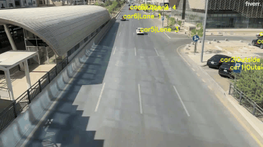

# Vehicle-Tracking-System



This is a project for tracking vehicles (lane of vehicle and the lane it through frames) using object detection RCNN and simple tracking algorithm that calculates the distance between detected objects between each frame and assigns the class label for which the distance is minimum and less than a threshold. Video is made from the perspective of a camera mounted on top of a bridge overlooking traffic.

## Getting Started
These instructions will get you a copy of the project up and running on your local machine for development and testing purposes. This project is in development stage so please feel free to create issues and pull requests.

1. ``` git clone https://github.com/RamishRasool14/Vehicle-Tracking-System.git ``` (Clone the repository)
2. ``` cd Vehicle-Tracking-System ``` (change directory to the project folder)
3. ``` pip3 install virtualenv ``` (if you don't have virtualenv installed)
4. ``` python3 -m venv venv ``` (create virtual environment named venv)
5. ``` source venv/bin/activate ``` (activate virtual environment)
6. ``` pip3 install -r requirements.txt ``` (install dependencies)
7. ``` source bash.sh``` (this will execute all the required python files and create the final video in the data folder)

(If you want to execute files individually ignore the 7th step and follow the following commands)

8. ``` python3 util.py -p (path to video)``` (this will convert the video to frames and save them in the frames folder)
9. ``` python3 getLaneCoordinates.py ``` (a new window will open. Label lanes from left to right lane by clicking on the image. Press 's' to save the coordinates)
10. ``` python3 getLaneCoordinates.py -t ``` ([Optional] click on the lane to test the coordinates you have saved)
11. ``` python3 getDistance.py ``` ([Optional] this will label the vehicles using a simple tracking algorithm and save the labeled vehicle in data folder if you want to see labels)
12. ``` python3 makeVideo.py ``` (this assumes, that you have cordinates of detected vehicle for each frame in a json file in data folder. Please check data folder for ''if all goes well this will get the final output video and final tracking_vehicle.json file is saved)

## Methodology
1. Detect vehicles using RCNN and save the coordinates of the bounding box for each frame in a JSON file. This is done using the provided jupyter notebook.
2. Draw lines on the image to represent the lanes using getLaneCoordinates.py. It saves slope and intercept for lines of the lane in a file. Pass -t flag to test the script.
3. Calculate the distance between the detected objects, assign the labels accordingly and the lane they are in using getDistance.py.
4. makeVideo.py converts frame from original video to corresponding labeled frame, with car number and lane number. Saves the final json file with the coordinates of the bounding box for each frame, lane it is in, its label and the car number. Finally creates a single labeled video from the frames.

## Improvements
1. Use a better tracking algorithm.
    For videos with more vehicles currently only car detections are tracked.

    Currently the alogirthm assigns same label to objects whose distance is minimum and less than a threshold between two consecutive frames. One possible issue with this approach is that if there is a missed detection between frames then the system will not be able to track the object. Same goes for objects that are obstructed for a few frames. So we need a way to somehow average across multiple frames to get a better estimate of the object's position.

2. Use image processing to detect lanes instead of manually drawing them.

3. Make script run in real time instead of processing the whole video at once.

4. Increase code modularity and separation of concerns.
